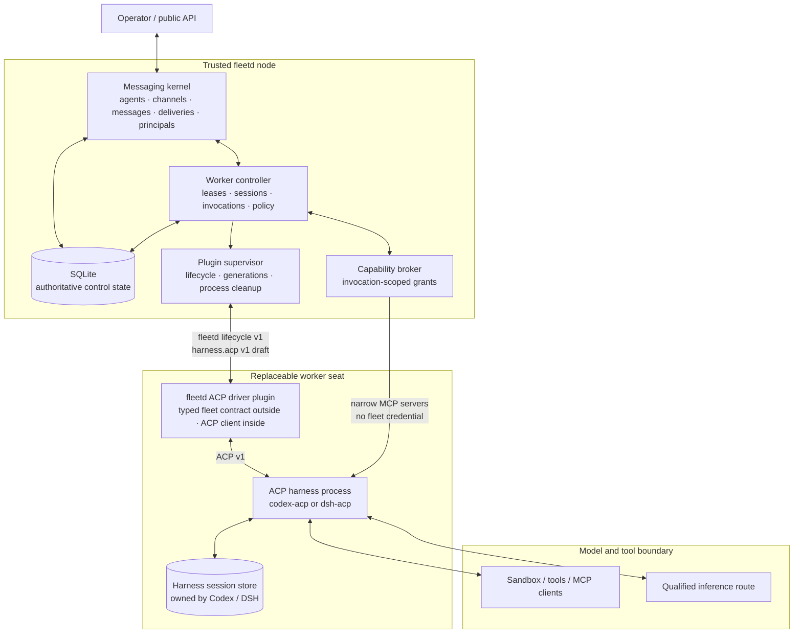
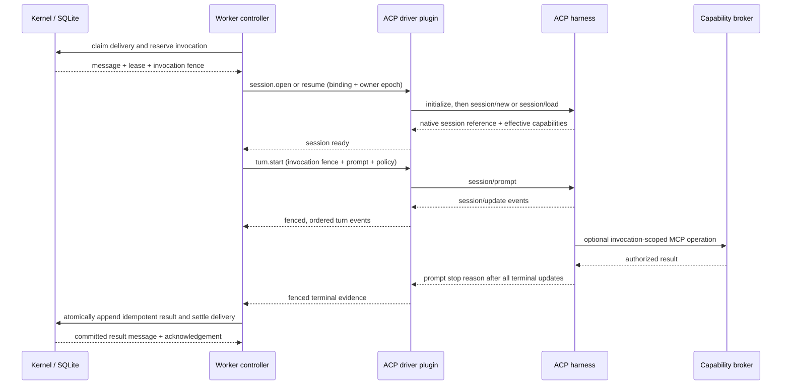
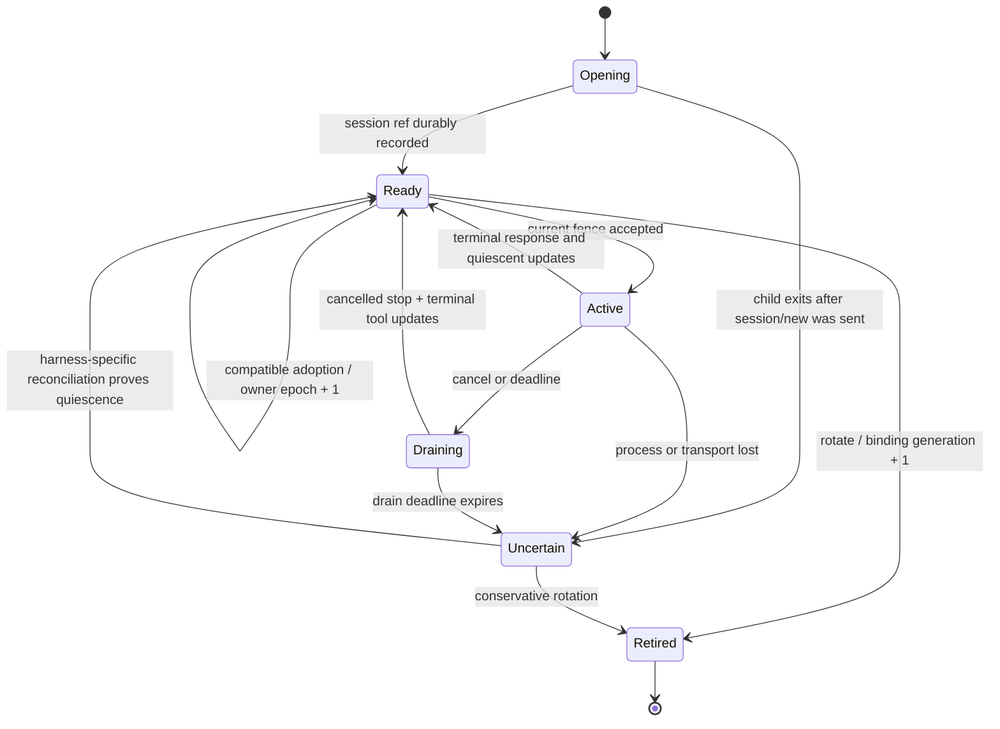
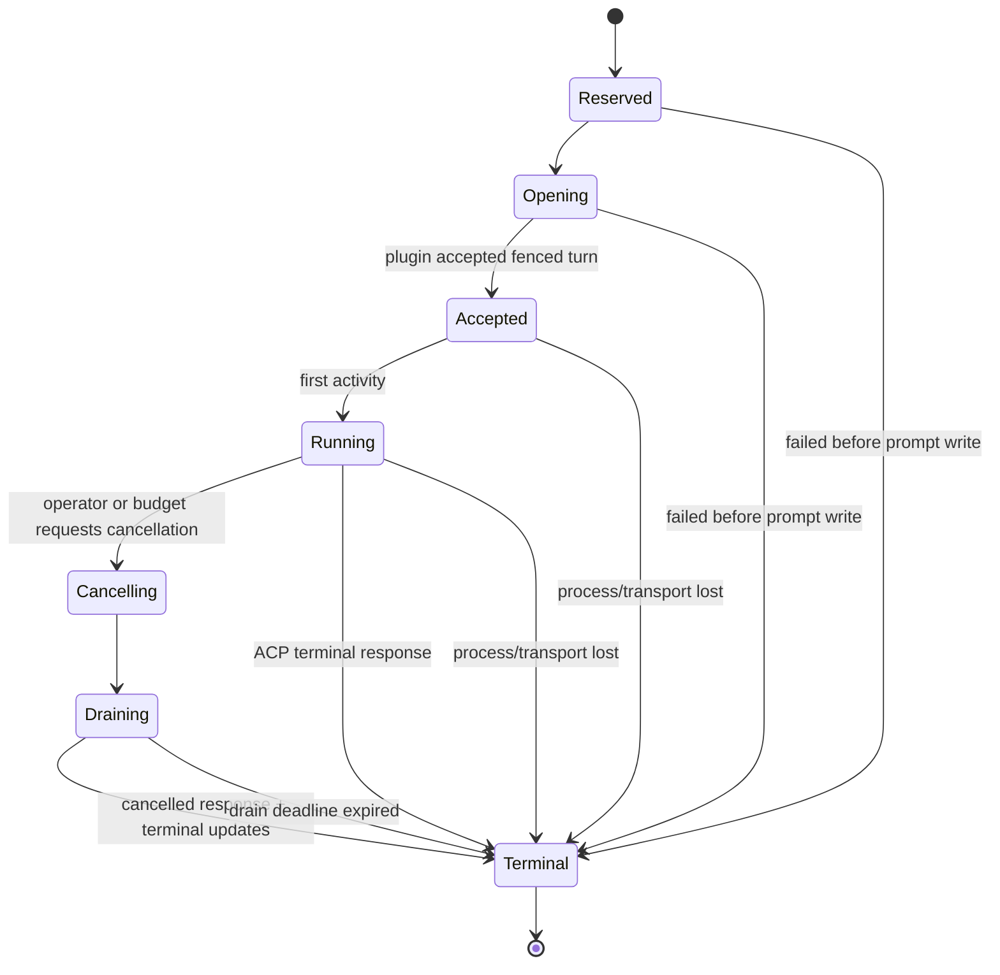
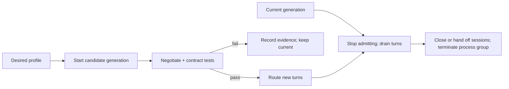

# Harness execution architecture

Status: design baseline for M1; the capability contract remains a draft until
it passes the Codex and DSH qualification matrix.

This document defines the layer between fleetd's durable agent inbox and an
agent harness. It deliberately does not add harness concepts to the messaging
kernel. The design is informed by two working systems:

- Buzz demonstrates that ACP can put Codex, DSH, Goose, and Claude behind one
  client boundary, and that cancellation, process-group cleanup, per-session
  serialization, and raw protocol observations matter in production.
- DSH demonstrates that an append-only harness session log, scoped plugin
  lifecycles, explicit flush barriers, and conservative crash repair make a
  strong worker body.

The corresponding negative lesson is equally important: durable delivery,
session ownership, retry decisions, and result admission cannot live only in a
large in-memory harness adapter.

## The shape



The logical worker controller is trusted fleetd code but is not part of the
messaging kernel. The first deployment may compose it into `fleetd serve` so a
single daemon can reserve work and record an invocation in one SQLite
transaction. A future external worker can exercise the same logic through the
public API with an agent-bound credential.

The ACP driver and harness are separate processes. The driver speaks fleetd's
strict plugin lifecycle on its outer stdio and uses an authoritative ACP SDK on
its inner connection. It is not a JSON-RPC tunnel: only the methods in the
draft `harness.acp` capability cross the fleet boundary.

## Four protocol layers

| Layer | Contract | Purpose | Authority |
| --- | --- | --- | --- |
| L0 | `fleetd` plugin lifecycle v1 | Start, identify, negotiate, health-check, and stop one plugin process | Process authority only |
| L1 | `harness.acp` v1 draft | Open a session, start/cancel one fenced turn, and report evidence | One invocation fence, never an inbox credential |
| L2 | ACP v1 | Initialize an agent, create/load sessions, prompt, stream updates, request permission, and cancel | Harness/session authority |
| L3 | Harness internals | Transcript, model loop, tools, sandbox, skills, compaction, provider calls | Harness-specific |

ACP v1 is the qualified target today. The driver records the exact SDK/schema
version and preserves ACP `_meta` and unknown update data. ACP v2 is currently
an unstable, materially different prompt lifecycle and must earn a new driver
qualification; it is not selected merely because a package contains its
schema.

## Ownership

| Fact or decision | Authoritative owner | Explicit non-owner |
| --- | --- | --- |
| Agent identity and channel membership | fleetd kernel | Harness |
| Immutable input and output messages | fleetd kernel | Driver memory |
| Inbox eligibility, attempts, and current lease | fleetd kernel | ACP session |
| Which worker generation may act | fleetd worker controller | Plugin self-report |
| Session lane policy | Versioned worker policy | Kernel |
| Session binding and fencing epoch | fleetd worker controller | Harness transcript |
| Native session transcript and compaction | Harness | fleetd kernel |
| Native session handle | Harness issues it; fleetd stores it opaquely | Message protocol |
| Model/tool loop | Harness | Worker controller |
| Wall-clock and cancellation deadlines | Worker controller | Prompt text |
| Tool or token budget strength | Negotiated effective capability | Requested configuration alone |
| Retry, block, or admit result | Worker controller policy | Harness stop reason alone |
| Raw trajectory | Harness session store | Fleetd message log |
| Bounded evidence and provenance | fleetd execution ledger | Operator UI projection |

The kernel still knows no `session`, `prompt`, `Codex`, or `DSH`. Those names
exist in the controller, capability contract, and replaceable plugins.

## Identity and fencing

The system needs more than one ID because each ID answers a different failure
question.

| Identity | Lifetime | Question answered |
| --- | --- | --- |
| `(agent_id, message_id)` | Permanent | Which durable inbox item is being processed? |
| `lease_token` | One claim | May this controller settle that delivery now? |
| `invocation_id` | One execution attempt | Which attempt produced this evidence and result? |
| `binding_id` | One logical session lane | Which conversation is this native session serving? |
| `binding_generation` | Until rotation | Which semantic incarnation of the session is current? |
| `owner_epoch` | One adoption by a worker generation | May this process still publish events for the session? |
| `plugin_instance_id` | One OS process | Which launch emitted the observation? |
| `session_ref` | Harness-defined | Which native session should be loaded or resumed? |

The authoritative turn fence is:

```text
(binding_id, binding_generation, owner_epoch, invocation_id, fence_token)
```

`fence_token` is a fresh opaque value derived for the invocation. It is not the
inbox lease token. The plugin never receives an agent bearer credential or the
right to acknowledge a delivery. Every plugin event and terminal response must
echo the fence. A late event from an old owner epoch can be retained as stale
evidence but cannot mutate current invocation or session state.

Three counters must not be collapsed:

- **Plugin generation** changes when the executable or effective launch
  profile changes.
- **Owner epoch** changes whenever a compatible existing session is adopted by
  another live process.
- **Binding generation** changes only when the logical session is rotated and
  a new native transcript is required.

This permits a new plugin process to resume a compatible DSH session while
still fencing the dead process. A model, adapter, or configuration change is
resume-compatible only when a qualified profile explicitly says so; the
default is rotation.

## Durable control records

These are controller records in the authoritative node SQLite database, kept
outside the messaging kernel module. This is a logical schema, not yet a
migration.

### `harness_profiles`

An immutable desired/effective launch snapshot:

- profile ID and content digest;
- ACP driver executable digest and version;
- inner ACP executable digest and version;
- exact arguments and explicitly granted environment names;
- ACP SDK/schema version;
- harness home/session root and composition digest;
- model, backend, permission mode, and MCP grant set;
- declared session compatibility key;
- qualification record and activation state.

Secrets are references to a broker or OS credential source, never stored raw in
the snapshot. A displayed snapshot redacts path or argument values classified
as sensitive.

### `plugin_generations`

One supervised launch attempt:

- plugin generation and instance ID;
- profile digest;
- observed plugin and ACP capabilities;
- start, ready, drain, exit, and forced-kill evidence;
- desired versus effective configuration drift.

### `session_bindings`

One current native session per versioned lane policy:

- binding ID, agent ID, and opaque lane key;
- binding generation and current owner epoch;
- opaque native session reference;
- profile and compatibility digests;
- `opening | ready | active | draining | uncertain | retired` state;
- last successfully quiesced turn and evidence reference.

The initial `channel-workspace-v1` lane policy uses one lane per
`(agent, channel, working-directory identity)`, retaining the useful part of
Buzz's conversational behavior without resuming one native transcript in a
different repository or worktree. That is an adapter policy, not a kernel rule.
The first controller runs at most one turn per managed agent, avoiding
cross-lane head-of-line complexity until real workloads justify concurrency.

### `invocations`

One durable attempt to process a delivery:

- invocation ID and `(agent_id, message_id)` delivery key;
- delivery attempt and the lease used by the controller, stored only where
  required for settlement;
- complete turn fence and profile digest;
- `reserved | opening | accepted | running | cancelling | draining | terminal`
  state;
- deadlines and effective enforcement strengths;
- terminal stop reason, execution certainty, retry advice, and admission
  decision;
- deterministic result idempotency key and committed result message ID.

### `invocation_events`

Bounded, ordered evidence:

- `(invocation_id, event_seq)` primary identity;
- fence and plugin instance ID;
- raw ACP update or a content-addressed artifact reference;
- normalized semantic classification;
- observed time, source, reliability, and redaction class.

Large prompts, tool output, and reasoning do not belong inline in the primary
control database. The harness transcript remains authoritative for the raw
trajectory. fleetd stores bounded evidence, hashes, and references sufficient
to explain control decisions.

## The agent-to-agent loop

Agents communicate through committed fleetd messages, never through direct
harness calls or shared in-memory futures.

```mermaid
sequenceDiagram
    participant U as Operator / upstream agent
    participant A as Agent A session
    participant K as fleetd messages + inboxes
    participant B as Agent B session

    U->>K: durable message to A
    K->>A: leased delivery resumes A's lane
    A->>K: MCP send to B (idempotent, correlated)
    K-->>A: committed message ID
    A-->>K: turn ends; no synchronous wait on B
    K->>B: leased delivery resumes B's lane
    B->>K: durable reply to A
    K->>A: new delivery resumes the same A lane
    A->>K: correlated result to U
```

Each agent has its own native session for the channel lane. Agents do not share
transcripts; the immutable message is the boundary between them. The outbound
send derives `sender_id` from the invocation grant, carries the original
correlation ID, and sets causation to the input message. Exact retries use an
idempotency key derived from `(invocation_id, tool_call_id)`.

The send operation returns the committed message ID, not the other agent's
answer. Waiting is represented by an idle harness session plus a future inbox
delivery. A later work contract may make dependencies and waiting explicit,
but the transport does not need a distributed call stack to achieve
continuation.

This design prevents a crashed caller from losing an accepted cross-agent
message and avoids holding one model turn, delivery lease, or process open
while another agent works. Outbound-message and correlation-hop limits belong
to the invocation grant or a versioned work policy, not the messaging kernel.

## Delivery-to-result transaction



The input delivery is acknowledged only after the correlated output message is
durable. Result append must be agent-scoped and idempotent. The required key is
deterministic from the invocation, for example
`invocation/<invocation_id>/result`. A retry with identical content returns the
existing message; reuse with different content is a conflict.

This closes the otherwise dangerous crash window where the result is committed
but the controller dies before acknowledging the input. Progress events use
the same pattern with `invocation/<id>/event/<seq>` when they are promoted to
messages.

## Session state



`session.open` is separate from `turn.start` so fleetd can persist the native
session reference before the first effectful prompt. If the response to
`session/new` is lost, an orphan transcript is acceptable; silently issuing a
second prompt is not.

Updates emitted while `session/load` replays old history are classified as
session-replay evidence. They cannot become output for the new invocation or
reset its idle deadline. The invocation event sequence begins only after the
session is ready and `turn.start` is accepted.

Only one active turn may own a binding. Session resumption requires:

1. the same session compatibility key;
2. an ACP capability that can load or resume the native reference;
3. exclusive adoption with an incremented owner epoch;
4. no unresolved invocation whose outcome might still arrive.

DSH's persistent session log can often satisfy these conditions. A harness
without load/resume support rotates after process loss.

Quiescent does not automatically mean durable. It proves that the ACP turn and
its admitted updates ended; it does not prove that a harness flushed its
session log to stable storage. Each effective profile records session
persistence as `confirmed`, `runtime_claimed`, or `unknown`. Crash resumption is
enabled only after the qualification suite kills the process immediately after
a completed turn and verifies continuity.

## Invocation state and honest outcomes



A terminal invocation records two orthogonal facts:

1. **Stop reason:** `end_turn`, `max_tokens`, `max_turn_requests`, `refusal`,
   `cancelled`, `idle_deadline`, `wall_deadline`, `protocol_failure`,
   `transport_failure`, `process_exit`, or a preserved unknown value.
2. **Execution certainty:** `not_started`, `outcome_known`, or
   `outcome_unknown`.

Examples:

| Evidence | Certainty | Default controller action |
| --- | --- | --- |
| Launch failed before `session/prompt` write | `not_started` | Safe to retry after policy delay |
| ACP returned `end_turn` and updates are quiescent | `outcome_known` | Verify, append result, acknowledge |
| ACP returned `cancelled` after terminal tool updates drained | `outcome_known` | Retry, block, or accept partial result by policy |
| Process exited after prompt acceptance | `outcome_unknown` | Do not blindly retry effectful work |
| Cancellation drain timed out | `outcome_unknown` | Fence generation and block or reconcile |
| DSH recovery proves a tool was never started | `not_started` for that effect | Policy may retry that effect |
| DSH reports interrupted tool with unknown outcome | `outcome_unknown` | Require idempotency evidence or review |

The plugin may supply evidence and retry advice. It cannot authorize retry or
result admission. Those are controller decisions bound to exact evidence and
policy.

The current delivery API has no explicit `blocked` settlement. Before running
effectful unattended workloads, fleetd needs either a durable blocked state or
a work-contract policy that retains the invocation without repeatedly
executing an unknown outcome.

## Budgets are claims with enforcement strength

A prompt saying "use two tools" is not a budget. Each effective budget records
one of these enforcement strengths:

- `hard`: admission is prevented before exceeding the limit;
- `observe_then_cancel`: crossing the observed limit triggers cancellation but
  already admitted work may finish;
- `provider_enforced`: the model or gateway claims to enforce the limit and
  supplies evidence;
- `unavailable`: the runtime cannot enforce or reliably observe it.

| Budget | Minimum v1 enforcement |
| --- | --- |
| Wall-clock deadline | `hard` in the controller |
| Idle deadline | `hard` from valid observed activity |
| Cancellation drain deadline | `hard` in controller and driver |
| Captured event/output bytes | `hard` at the driver boundary |
| Tool calls or batches | `observe_then_cancel` unless permission/MCP mediation gates admission |
| Tokens | `provider_enforced` or `observe_then_cancel`; never inferred from prompt text |
| External side effects | `hard` only through an idempotent or authorization-mediating capability |

ACP tool updates may arrive after the harness has already admitted a tool. The
driver therefore cannot advertise a hard tool budget merely because it counts
updates. A hard budget requires ACP permission requests, brokered MCP tools, or
another pre-execution gate.

ACP is bidirectional internally: an agent may request permission or optional
client filesystem/terminal services. The fleetd outer lifecycle intentionally
does not accept plugin-initiated requests. The driver bridges permission with a
typed notification followed by a host-initiated resolution call. Other ACP
client services are disabled unless the effective profile advertises a
separately typed, brokered implementation; the driver never turns them into a
generic host-call escape hatch.

Cancellation is a protocol, not a signal:

1. controller fences the invocation as cancelling;
2. driver sends ACP `session/cancel`;
3. driver continues accepting final `session/update` tool events;
4. permission requests are answered as cancelled;
5. original prompt reaches a cancelled terminal response;
6. only then is the session quiescent and reusable.

If the drain deadline expires, the driver kills the ACP process group and the
outcome is unknown.

## Evidence and metrics

Every normalized value retains provenance:

```json
{
  "value": 7946,
  "unit": "tokens",
  "source": "acp.prompt_response.usage.cachedReadTokens",
  "scope": "session_cumulative",
  "reliable": true
}
```

Missing is not zero. Cumulative counters are converted to turn deltas only when
the driver has an unbroken baseline. If a counter disappears, regresses, or
changes identity, reliability becomes false and stays false for that native
session unless a protocol-defined reset is observed.

Model decode throughput should come from the inference gateway when available,
not be guessed from ACP text-chunk timing. ACP timing remains useful as
end-to-end worker latency. Metrics are always scoped to the full effective
profile: harness version, model revision, backend revision, tenant, cache
configuration, and composition digest.

Raw protocol evidence is bounded and redacted before it enters the controller
ledger. Unknown ACP `_meta`, update kinds, and stop reasons remain attached as
opaque JSON so a newer observer can reinterpret old evidence.

## Credentials and grants

There are three different credential classes:

1. **Fleet identity:** held only by the trusted controller. Never passed to the
   driver, ACP harness, MCP tool process, or model environment.
2. **Model-provider credential:** supplied to the harness through an explicit
   broker, file descriptor, keychain lookup, or narrowly allowlisted launch
   field. It is never copied into a profile snapshot or log.
3. **Invocation grant:** short-lived authority for a named fleet capability,
   bound to agent, invocation, fence, operation set, and expiry.

The preferred privileged-action path is a controller-spawned MCP sidecar with
an invocation grant. The harness can call it, but model-run shell commands do
not inherit the fleet credential. This is authority minimization, not an OS
sandbox: same-UID processes may still inspect user-readable files unless a
stronger sandbox is added.

The outer driver starts with an empty environment. It launches an absolute ACP
executable without a shell and constructs a fresh allowlisted environment for
that child. This specifically prevents leaked `GIT_CONFIG_*`, provider, and
desktop-process variables from becoming accidental runtime inputs.

## Profiles, qualification, and hot replacement

A runtime is not "DSH" or "Codex" in the abstract. It is an exact profile:

```text
driver digest
+ ACP SDK/schema version
+ ACP adapter digest/version
+ harness composition digest
+ model and inference-backend revision
+ explicit environment and arguments
+ MCP grant set and permission policy
= effective profile digest
```

Qualification records observed capability responses rather than trusting CLI
flags or marketing claims. This matters for the currently qualified DSH stack:

- `@deepseek-ai/dsh` `0.1.1-rc.2`;
- `@openma/deepseek-harness-acp` `0.4.22`;
- `@agentclientprotocol/sdk` `1.4.0`;
- DSH ACP flags that parse but do not affect boot configuration;
- the LLM session-title plugin destroying prompt-cache reuse for the tested
  local route.

The qualified local DSH profile therefore includes its composition overlay and
disables only the LLM title plugin. That is a profile fact, not a universal DSH
rule.

Hot replacement is generation-based:



No running process is silently mutated. New turns route only after readiness
and qualification. Existing sessions either drain on the old generation or are
exclusively adopted by a resume-compatible generation with an incremented
owner epoch.

## Gaps in the current foundation

The existing lifecycle code is a sound L0 boundary, but the architecture above
must not be mistaken for code that already exists. The next implementation has
these prerequisites:

1. **Descendant cleanup.** The current supervisor kills its direct plugin
   child. An ACP driver creates another process, so the supervisor and driver
   need a process-group/job-object ownership rule that reaps the complete
   descendant tree on startup failure, forced shutdown, and drop.
2. **Typed domain calls.** `PluginProcess` currently exposes lifecycle methods
   and opaque notifications only. Add a `HarnessAcpClient` that owns the draft
   methods without making the underlying generic JSON-RPC call public.
3. **Continuous evidence draining.** The current 256-entry notification buffer
   fails closed when exhausted and exposes only non-blocking polling. Add a
   continuously driven receiver with explicit backpressure. The ACP driver
   should coalesce token fragments into bounded ordered batches; it must not
   emit one fleet event per decoded token.
4. **Durable invocation reservation.** Inbox claim and invocation creation
   need one transaction in the embedded controller so a restart can distinguish
   unstarted work from an unrecorded attempt.
5. **Unknown-outcome parking.** The current delivery states cannot explicitly
   park an ambiguous effect for operator or policy review. Do not run
   unattended effectful work until that state exists.
6. **Effective instance evidence.** Persist the lifecycle instance ID,
   profile digest, inner executable identity, observed ACP initialize result,
   and exit evidence together; desired config alone is insufficient.
7. **Bounded artifact capture.** Inner ACP frames may exceed fleetd's one-MiB
   outer frame. Add a content-addressed evidence sink or emit an explicit
   truncated prefix, full-byte count, and digest. Oversized data must never be
   silently dropped or smuggled through larger lifecycle frames.

These are reliability requirements for the first vertical loop, not a request
to expand the messaging kernel with harness semantics.

Agent-scoped idempotent message append is already implemented by
[ADR 0006](adr/0006-idempotent-message-append.md); the controller can use a
deterministic invocation-result key when it reaches the final commit boundary.

## First implementation acceptance matrix

The `harness.acp` capability is not stable until the same tests pass through
both `codex-acp` and `dsh-acp`:

1. initialize and capture exact effective capabilities;
2. create a session, finish a turn, restart the driver, and resume a second
   turn when the harness advertises support;
3. preserve text, reasoning, tool, plan, usage, and unknown update data;
4. reject a stale terminal event after owner epoch changes;
5. cancel during tool activity, drain terminal updates, and prove quiescence;
6. kill before prompt write and classify `not_started`;
7. kill after prompt acceptance and classify `outcome_unknown`;
8. enforce wall, idle, drain, and output bounds independently;
9. append one deterministic result and acknowledge the delivery atomically,
   including restart immediately around commit;
10. replace a runtime generation without routing work to an unqualified child;
11. prove that no fleet bearer credential or ambient environment reaches the
    plugin or harness;
12. report usage reliability and effective profile provenance without treating
    missing values as zero.

The first useful closed loop is one addressed message, one leased invocation,
one ACP session, one correlated result, and one acknowledgement. Workflow,
review, Git, and multi-agent planning remain later contracts built on that
loop.

## Deliberate exclusions

- The ACP driver does not schedule a fleet.
- DSH Agent Teams are not fleet identities or durable fleet deliveries.
- The messaging kernel does not parse prompts, transcripts, tool calls, or
  stop reasons.
- The driver does not expose arbitrary ACP or JSON-RPC methods.
- fleetd does not duplicate the DSH or Codex transcript.
- WebSocket delivery is not work ownership.
- Session resumption is never inferred from a coincidentally reusable string
  ID.
- A process exit, timeout, or missing observation is never interpreted as proof
  that an external effect did not happen.
